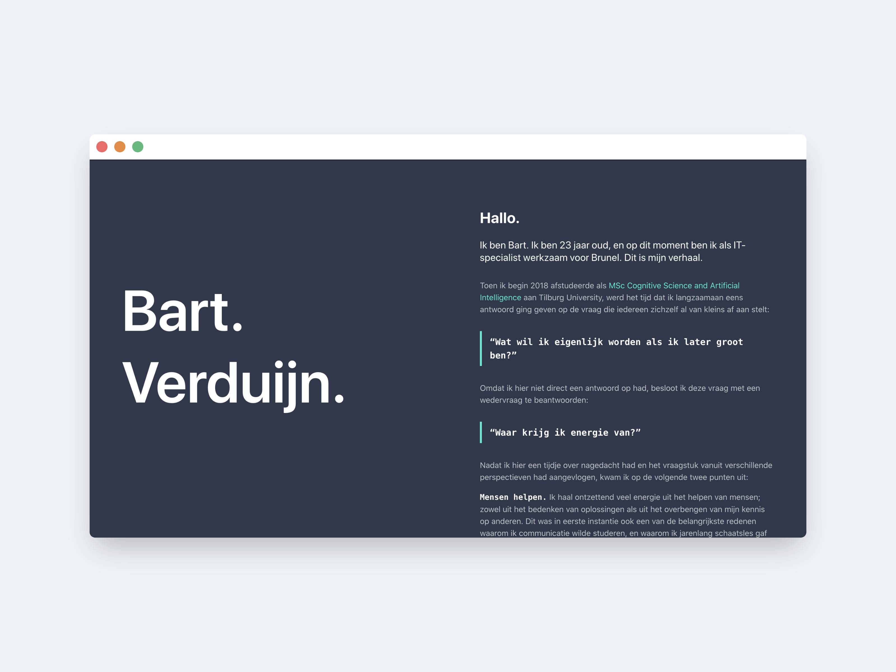

# Nieuwe website!

Zoals je misschien al gelezen hebt op de homepagina, bouwde ik ongeveer 2 jaar
geleden mijn eerste eigen website. Dit was niet meer dan één pagina die als een
soort coverletter voor mijn LinkedIn zou moeten gelden. Afgelopen jaren heb ik
me echter meer verdiept in web development, en vond ik het dus leuk om iets
nieuws te leren en te proberen. Vandaar dus een nieuwe website.

## Stack

### Gatsby en MDX

Deze website is gebouwd op [Gatsby](https://www.gatsbyjs.org/) in combinatie met
[MDX](https://mdxjs.com/). Hierdoor kan ik posts en tekst gewoon schrijven in
Markdown, en worden hier automatisch pagina's van gegenereerd. Dit vond ik
belangrijk, omdat ik bij mijn vorige website merkte dat ik het heel irritant
vond dat ik bij het schrijven van een text rekening moest houden met `
` en
`<ul>` tags voor paragrafen en opsommingen.

### Tailwind en Styled Components

Voor styling maak ik gebruik van een combinatie tussen
[Tailwind CSS](https://tailwindcss.com/) en
[Styled Components](https://styled-components.com/). Tailwind gebruikte ik ook
al voor mijn vorige website, omdat ik het fijner vond om in de browser te
designen, dan in een aparte tool. Het voordeel van Styled Components vond ik
echter dat de scope van je CSS heel erg duidelijk is. Omdat je in React toch al
met componenten werkt, is dat een logische stap. Daarom maak ik het volgende
onderscheid:

-   Ik maak alles eerst met Tailwind, zodat ik snel een beeld heb hoe het eruit
    komt te zien.

-   Als ik tevreden ben, kijk ik wat logisch is om te abstraheren naar een
    component. Denk bijvoorbeeld aan buttons, of links: dingen die je vaak
    gebruikt over de hele website.

-   Margins blijven Tailwind! Ik ben namelijk van mening dat een component
    overal op je website geplaatst zou moeten kunnen worden. Je margin hangt af
    van de _context_ van de pagina, en hoort dus niet thuis in een component.
